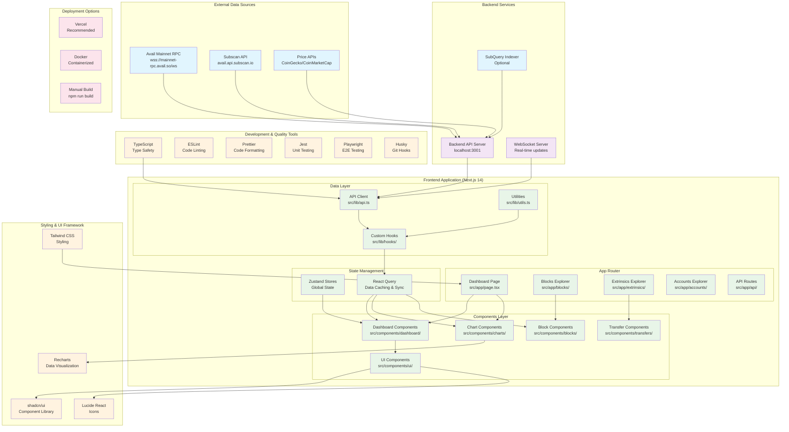
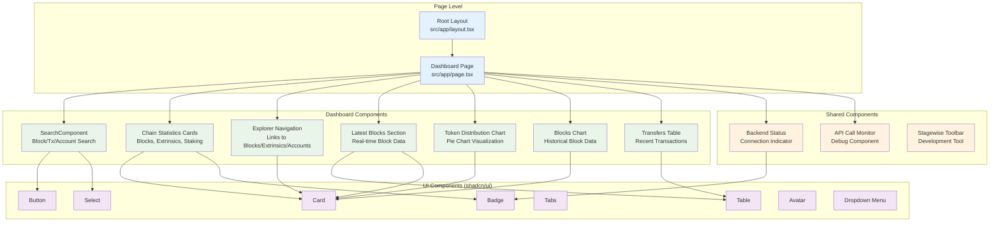
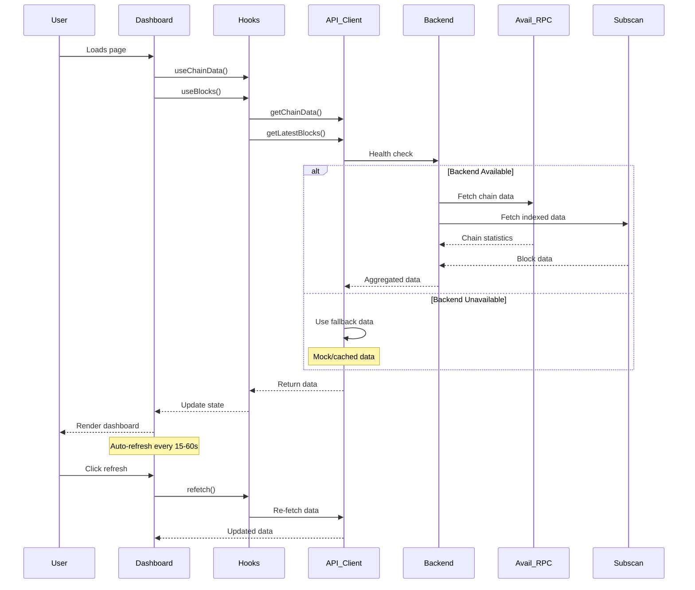
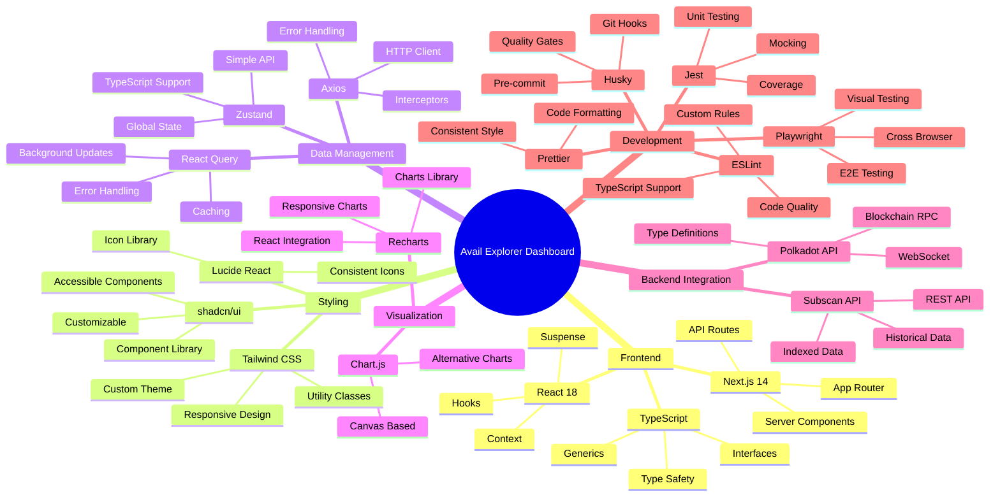
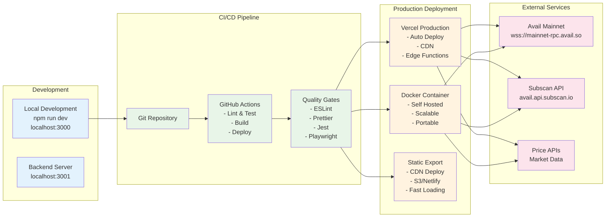

# Avail Explorer Dashboard - Project Architecture

## Overview

This document contains the mermaid diagrams explaining the architecture of the Avail Explorer Dashboard project.

## Main Architecture Diagram

## Component Hierarchy Diagram

## Data Flow Diagram

## Technology Stack Overview

## Deployment Architecture

## Key Features & Capabilities

### 🚀 Core Features

- **Real-time Chain Data**: Live blockchain statistics and metrics
- **Block Explorer**: Browse and search blockchain blocks
- **Transaction Explorer**: View extrinsics and transaction details
- **Account Explorer**: Account information and transaction history
- **Token Analytics**: Price tracking and distribution visualization
- **Search Functionality**: Universal search for blocks, transactions, and accounts

### 🏗️ Architecture Highlights

- **Hybrid Data Strategy**: Backend + fallback frontend API calls
- **Real-time Updates**: WebSocket integration for live data
- **Performance Optimized**: React Query caching and background updates
- **Type Safety**: Full TypeScript implementation
- **Responsive Design**: Mobile-first approach with Tailwind CSS
- **Quality Assurance**: Comprehensive testing and code quality tools

### 🔧 Development Features

- **Hot Reloading**: Fast development with Next.js
- **Code Quality**: ESLint, Prettier, and pre-commit hooks
- **Testing**: Unit tests (Jest) and E2E tests (Playwright)
- **Documentation**: Comprehensive guides and API documentation
- **Monitoring**: API call monitoring and backend status tracking

### 🚀 Deployment Options

- **Vercel**: Recommended for easy deployment and scaling
- **Docker**: Containerized deployment for any environment
- **Static Export**: For CDN deployment and maximum performance
